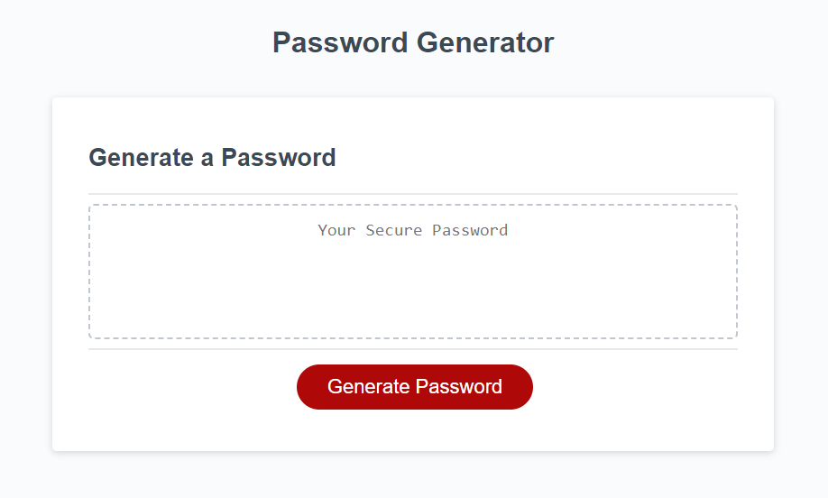

# <javascript-password-generator>

## Description

This project was to build a website that would generate a randomized password, tailored to the length and desired characters chosen by the user. It required practice with arrays, functions, for loops, and event listeners. It concatinates an array of possible characters based on what characters the user wants to work with, and then chooses random items from that final array based on the desired length.

The project was a serious exercise in debugging and testing. Because there were so many questions required of the user, I needed to test repeatedly to make sure no answer combos caused issues.

## Usage

The application displays a large, red Generate Password button. Upon clicking, the application will ask you for the desired parameters of the final password

1) How many characters would you like your password to be (must be between 8 and 128 characters, must be numerical value)
2) What character types do you want to include, with the options lowercase letters, uppercase letters, numbers, and special characters (must choose at least one of these options)

When the questions are answered, the user will receive their final password in the center box of the browser window.

The JavaScript Password Generator can be found [here](https://collylee.github.io/javascript-password-generator/)

## Credits

This application was built using starter code provided by UPenn's coding bootcamp.